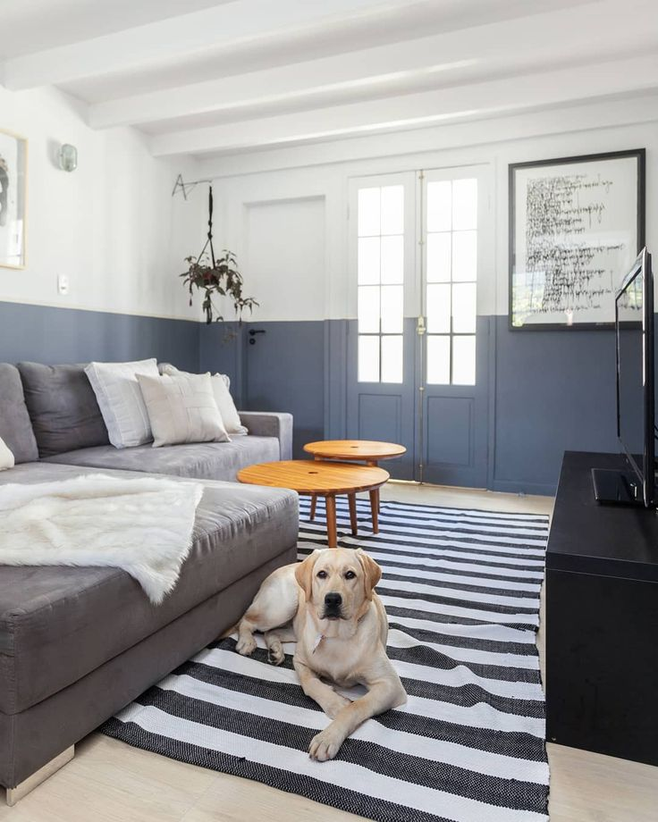

# Portfólio Rodrigo Balestrim

Portfólio pessoal desenvolvido para apresentar meus projetos, conhecimentos e formas de contato como Desenvolvedor Web Júnior.

## Acesse o projeto

- **Portfólio online:** [portfolio-3d-eight-nu.vercel.app](https://portfolio-3d-eight-nu.vercel.app/)
- **GitHub:** [RodrigoBalestrim/portfolio-rodrigo-balestrim](https://github.com/RodrigoBalestrim/portfolio-rodrigo-balestrim)
- **LinkedIn:** [Rodrigo Balestrim](https://www.linkedin.com/in/rodrigo-balestrim-9a68b3212/)

## Prévia

[](https://portfolio-3d-eight-nu.vercel.app/projetos)

> Clique na imagem para abrir a área de projetos do portfólio.

## Sobre o projeto

O site foi criado para reunir meus projetos autorais em uma navegação moderna, responsiva e com animações. Ele apresenta informações profissionais, habilidades, tecnologias utilizadas, projetos desenvolvidos e meios de contato.

### Principais recursos

- Navegação entre páginas com animações e transições visuais.
- Layout responsivo para computador e celular.
- Seção de projetos com prévias, tecnologias usadas e links para acessar cada projeto.
- Formulário de contato integrado ao WhatsApp.
- Links para GitHub, LinkedIn, Behance, Instagram e WhatsApp.
- Efeitos de partículas e elementos 3D para uma identidade visual mais dinâmica.

## Como foi feito

O projeto foi construído com **Next.js** e **React**, utilizando componentes para organizar cada página do portfólio. A estilização responsiva foi realizada com **Tailwind CSS** e CSS personalizado. As animações e transições foram desenvolvidas com **Framer Motion**.

Para apresentar os projetos, foi utilizado o **Swiper**. Os ícones foram implementados com **React Icons** e o fundo interativo utiliza **tsParticles**. O versionamento é feito com **Git e GitHub**, e a publicação foi realizada na **Vercel**.

## Tecnologias utilizadas

| Tecnologia | Uso no projeto |
| --- | --- |
| HTML5 e CSS3 | Estrutura e estilização das páginas |
| JavaScript | Interações e comportamentos da interface |
| React | Componentização da interface |
| Next.js | Estrutura do projeto e rotas |
| Tailwind CSS | Estilização responsiva |
| Framer Motion | Animações e transições |
| Swiper | Carrossel de projetos |
| tsParticles | Fundo visual interativo |
| React Icons | Ícones da interface |
| Git e GitHub | Versionamento do código |
| Vercel | Hospedagem e publicação |

## Projetos apresentados

- **Mister Color:** site institucional de uma marca de tintas com catálogo visual e foco em cores e ambientes.
- **M3 Engenharia:** site institucional com apresentação de serviços e soluções de engenharia.
- **Terra Viva:** conceito de site para produtos naturais, com foco em bem-estar e identidade visual.

## Como executar localmente

```bash
git clone https://github.com/RodrigoBalestrim/portfolio-rodrigo-balestrim.git
cd portfolio-rodrigo-balestrim/portfolio-3d
npm install
npm run dev
```

Para visualizar a versão publicada, abra [https://portfolio-3d-eight-nu.vercel.app/](https://portfolio-3d-eight-nu.vercel.app/) no navegador.

## Contato

- WhatsApp: [(44) 99707-5042](https://wa.me/5544997075042)
- E-mail: wbalestrim1@gmail.com
- GitHub: [@RodrigoBalestrim](https://github.com/RodrigoBalestrim)
